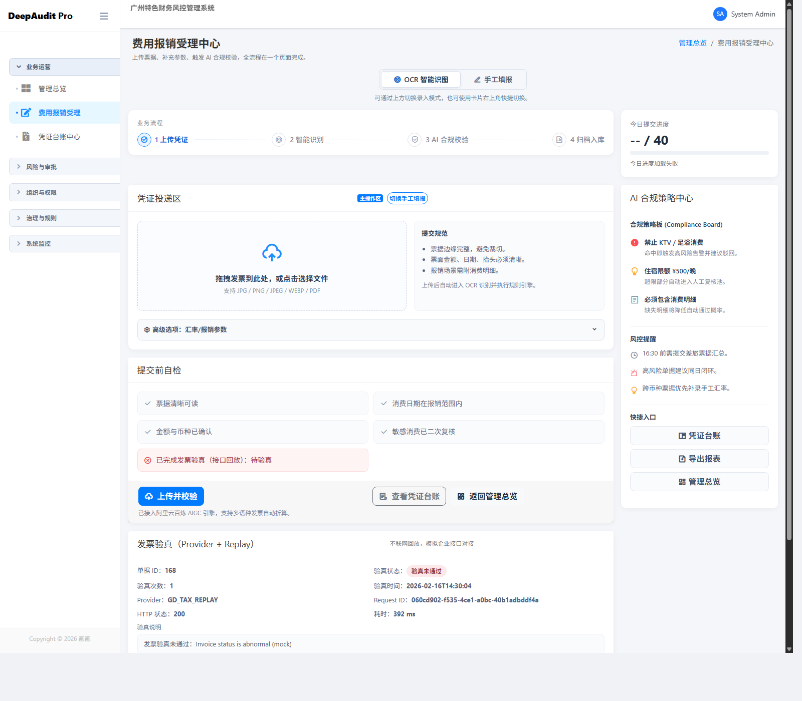
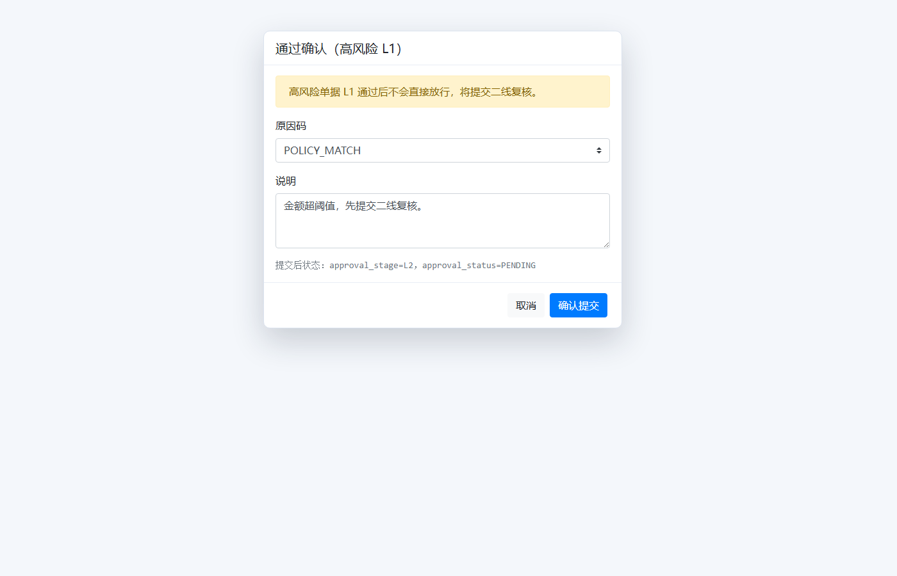
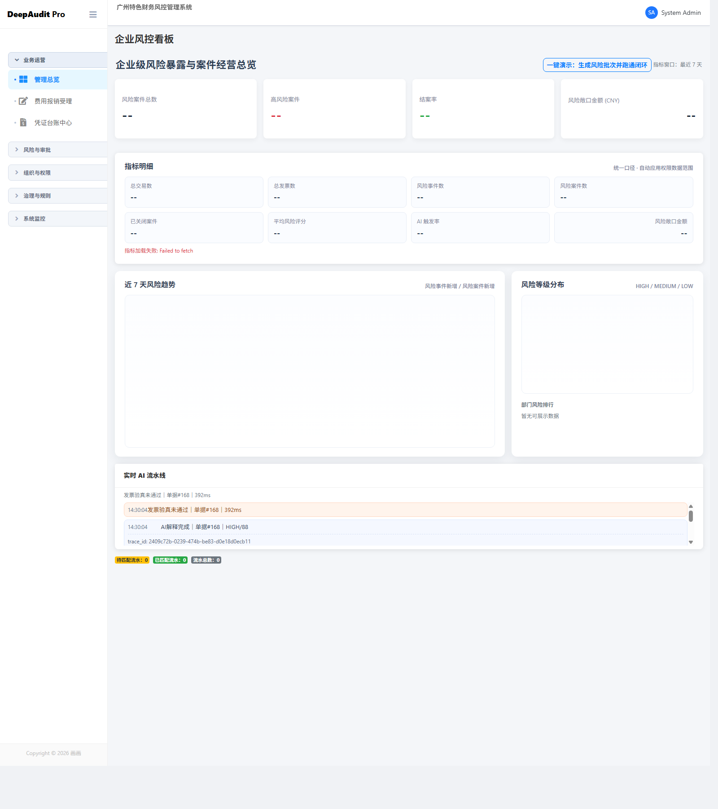

# DeepAudit Pro 智能审计系统

<div align="center">


**企业级智能费用审计系统 | 发票自动识别 | 智能风控 | 在线审批**

</div>

---

## 📋 目录

- [系统简介](#系统简介)
- [核心功能](#核心功能)
- [技术架构](#技术架构)
- [快速开始](#快速开始)
- [功能演示](#功能演示)
- [系统架构](#系统架构)
- [开发指南](#开发指南)
- [常见问题](#常见问题)
- [更新日志](#更新日志)
- [许可证](#许可证)

---

## 🎯 系统简介

DeepAudit Pro 是一款企业级智能费用审计系统，通过 AI 技术实现发票自动识别、智能风控、在线审批的全流程数字化管理，帮助企业提升审计效率，降低财务风险。

### ✨ 核心特性

- 🤖 **智能识别**：基于 OCR 技术自动识别发票信息，准确率 > 95%
- 🛡️ **智能风控**：实时风险评估与发票验真，多维度异常检测
- 📝 **灵活审批**：多级审批流程，支持转派、退回、批量审批
- 📊 **数据分析**：实时数据看板，多维度统计分析与报表导出
- 🔐 **权限管控**：细粒度权限控制，数据范围隔离，操作审计追溯

---

## 🚀 核心功能

### 1. 发票上传与识别
- 支持图片/PDF格式上传
- 自动OCR识别发票金额、日期、商户信息
- 智能字段校验与补全提示

### 2. 智能风控中心
- 自动风险等级评估（高/中/低）
- 实时发票验真接口对接
- 异常交易预警与案件管理

### 3. 审批管理工作台
- 多级审批流程（一级/二级审批）
- 审批任务自动分配
- 支持通过、退回、转派操作

### 4. 凭证台账管理
- 全量单据查询与筛选
- 按日期、部门、金额、风险等级检索
- 一键导出Excel报表

### 5. 数据看板
- 实时关键指标展示
- 趋势图表与统计分析
- 部门维度数据对比

### 6. 系统管理
- 用户与角色管理
- 权限配置与数据范围控制
- 系统参数设置

---

## 🏗️ 技术架构

### 技术栈

**后端**
- Python 3.8+
- Flask Web框架
- SQLAlchemy ORM
- SQLite数据库

**前端**
- Bootstrap 5
- jQuery
- Chart.js 数据可视化
- Tom-Select 下拉选择组件

**AI能力**
- OCR文字识别
- 规则引擎风控
- 数据分析算法

### 项目结构

```
DeepAudit_pro/
├── core/                   # 核心模块
│   ├── app_factory.py     # 应用工厂
│   ├── extensions.py      # 扩展组件
│   ├── logging.py         # 日志配置
│   └── settings.py        # 系统设置
├── models/                 # 数据模型
│   ├── audit_log.py       # 审计日志
│   └── risk_event.py      # 风险事件
├── routes/                 # 路由控制器
│   ├── dashboard.py       # 数据看板
│   ├── invoices.py        # 发票管理
│   ├── approval.py        # 审批流程
│   ├── risk.py            # 风控中心
│   └── ...
├── providers/              # 外部服务提供者
│   ├── mock_bank.py       # 银行接口
│   ├── mock_erp.py        # ERP接口
│   └── mock_tax.py        # 税务接口
├── data_platform/          # 数据平台
│   ├── data_collector.py  # 数据采集
│   ├── data_processor.py  # 数据处理
│   └── data_analyzer.py   # 数据分析
├── templates/              # 前端模板
├── static/                 # 静态资源
├── scripts/                # 工具脚本
├── tests/                  # 测试用例
├── app.py                  # 应用入口
└── requirements.txt        # 依赖清单
```

---

## 🎬 快速开始

### 环境要求

- Python 3.8 或更高版本
- Windows / macOS / Linux

### 安装步骤

1. **克隆项目**

```bash
git clone https://github.com/xchen1012a-sketch/DeepAudit_Pro.git
cd DeepAudit_Pro
```

2. **安装依赖**

```bash
pip install -r requirements.txt
```

3. **初始化数据库**

```bash
python scripts/init_db_keep_admin01.py
```

4. **启动系统**

**方式一：一键启动（推荐）**
```bash
# Windows用户
双击运行 一键启动.bat

# Linux/Mac用户
python app.py
```

**方式二：命令行启动**
```bash
python app.py
```

5. **访问系统**

打开浏览器访问：`http://127.0.0.1:5000`

### 默认账号

| 角色 | 用户名 | 密码 |
|------|--------|------|
| 管理员 | admin01 | admin123 |
| 财务专员 | finance01 | finance123 |

---

## 🖼️ 功能演示

### 发票上传与识别


### 审批管理工作台


### 数据看板


---

## 🔧 开发指南

### 本地开发

```bash
# 安装开发依赖
pip install -r requirements.txt

# 运行测试
python -m pytest tests/

# 启动开发服务器
python app.py
```

### 数据库管理

```bash
# 初始化数据库
python scripts/init_db_keep_admin01.py

# 创建管理员账号
python scripts/create_admin.py

# 检查账号状态
python scripts/check_admin.py

# 导入演示数据
python scripts/seed_demo.py
```

### 代码规范

- 遵循 PEP 8 Python代码规范
- 使用有意义的变量和函数命名
- 添加必要的注释和文档字符串
- 提交前运行测试确保功能正常

---

## ❓ 常见问题

### Q1：上传发票后找不到单据？
**A**：请在"我的单据"中查找，如果金额和日期完整会自动进入"凭证台账"。

### Q2：单据一直显示"待补录"？
**A**：需要补充完整信息（金额和开票日期），然后点击"入账并进入审批"。

### Q3：审批时提示"无权访问"？
**A**：可能原因：
- 不是您负责的审批环节
- 该单据不在您的数据权限范围内
- 不能审批自己提交的单据

### Q4：如何导出数据？
**A**：在"凭证台账"页面设置筛选条件后，点击"导出报表"按钮下载Excel文件。

### Q5：系统无法启动？
**A**：检查：
- Python版本是否为3.8+
- 端口5000是否被占用
- 查看启动日志错误信息

更多问题请查看 [系统使用说明书.txt](系统使用说明书.txt)

---

## 📝 更新日志

### v2.0 (2026-02-20)
- ✨ 优化审批流程，支持批量操作
- 🔒 增强数据权限控制
- 🎨 改进用户界面，提升用户体验
- 🐛 修复已知问题

### v1.0 (2025-12-01)
- 🎉 首次发布
- ✅ 实现核心功能模块

---

## 📄 许可证

本项目采用 MIT 许可证。详见 [LICENSE](LICENSE) 文件。

---

## 🤝 贡献

欢迎提交 Issue 和 Pull Request！

1. Fork 本项目
2. 创建特性分支 (`git checkout -b feature/AmazingFeature`)
3. 提交更改 (`git commit -m 'Add some AmazingFeature'`)
4. 推送到分支 (`git push origin feature/AmazingFeature`)
5. 提交 Pull Request

---

## 📧 联系方式

如有任何问题或建议，欢迎通过以下方式联系：

- 📮 提交 [Issue](https://github.com/xchen1012a-sketch/DeepAudit_Pro/issues)
- 📧 Email: support@deepaudit.com

---

<div align="center">

**⭐ 如果这个项目对你有帮助，请给一个 Star！⭐**

Made with ❤️ by DeepAudit Team

</div>

